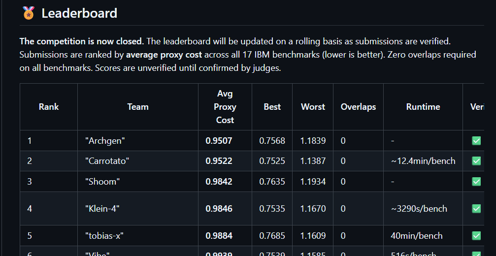
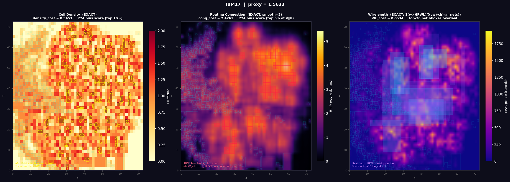
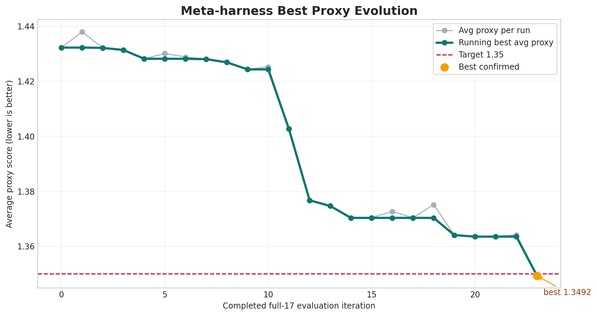
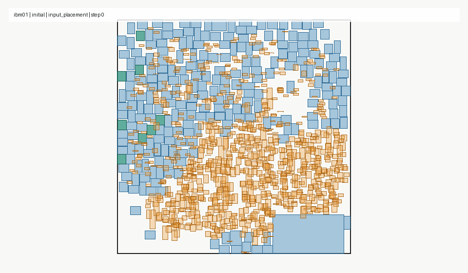
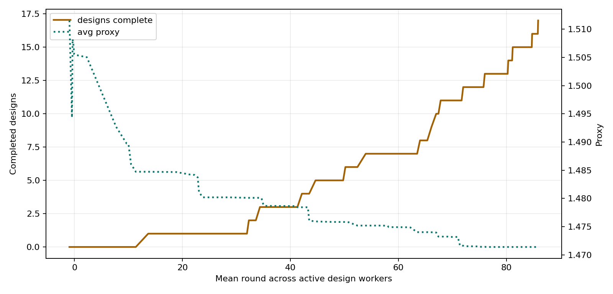

# How We Ranked First in the Partcl and Hudson River Trading Macro Placement Challenge

_A technical write-up of the approach behind our verified rank-1 score on the IBM macro-placement benchmarks._

Partcl (backed by Khosla Ventures) and Hudson River Trading ran the Macro Placement Challenge to evaluate macro placement systems on the IBM benchmark suite. The objective was to generate legal placements with the lowest average proxy cost across the designs, with zero hard-macro overlaps and a fixed runtime budget.

Our submission ranked first on the verified leaderboard with an average proxy cost of 0.9507 and zero hard-macro overlaps. This article documents how we started, what we tried, and how the final approach evolved.

Official contest repository: [partcleda/macro-place-challenge-2026](https://github.com/partcleda/macro-place-challenge-2026).



That contest structure shaped the whole project.

## The Problem

Macro placement is the part of physical design where large blocks, such as memories and IP macros, are assigned locations on the chip canvas. The placement must satisfy hard geometric constraints, but geometry alone is not enough. A floorplan can look clean to a human eye and still fail later when detailed routing spends hours exposing narrow channels, local overflow, and insufficient routing capacity.

The challenge compressed that downstream pain into a faster public proxy:

```text
proxy = wirelength + 0.5 * density + 0.5 * congestion
```

Lower is better.

| Term | What it measures | Why it matters |
| --- | --- | --- |
| Wirelength | Normalized HPWL-style connectivity cost. | Connected macros should not be pulled unnecessarily far apart. |
| Density | Local concentration of objects. | Dense regions leave less freedom for placement and routing. |
| Congestion | Routing demand relative to routing supply. | Overloaded routing bins are where visually clean floorplans become expensive. |

The benchmarks gave us hard macros, soft macros, a canvas, and a netlist. Hard macros had to stay inside the canvas and could not overlap. The solution also had to run under the contest time limit for every benchmark.

At the start, it was tempting to think of the objective as a balanced wirelength, density, and congestion problem. The component tables quickly corrected that assumption.

In strong late-stage runs, wirelength was already around 0.07 to 0.08. Congestion was still large. One representative decomposition looked like this:

| Component | Raw value | Weighted contribution | Share of proxy |
| --- | ---: | ---: | ---: |
| Wirelength | 0.0759 | 0.0759 | ~8% |
| Density | 0.5195 | 0.2597 | ~27% |
| Congestion | 1.2517 | 0.6259 | ~65% |

That is the point where the optimization target changed. We still had to protect HPWL, but the score was moving through density and congestion.



## Phase 1: Baseline Macro Placement

Our first approach was straightforward: run a basic macroplacer, legalize hard macros, evaluate the proxy, and compare against the suite. It gave us valid placements and early full-suite averages in the rough 1.4 to 1.5 range.

That baseline was useful because it made the problem measurable. We were not mainly failing because the placer could not make legal floorplans. We were failing because the legal floorplans still concentrated too much routing and density pressure.

The first reliable improvements came from exact-scored repair:

- keep a legal hard-macro placement,
- make candidate moves,
- reject hard-macro overlaps,
- score the candidate with the same proxy components,
- accept only if the measured proxy improved,
- validate on all designs, not just one benchmark.

This moved the system into the low 1.2 range. More importantly, it established the rule that survived to the end: no candidate mattered until it passed legality, exact scoring, runtime, and full-suite checks.

## Phase 2: Auto-Research Harness

Inspired by Andrej Karpathy's framing of auto-research, we built an experiment harness around the placer: propose a candidate, run it, read the measurements, and continue from the result.

The harness was not a model and not a replacement for engineering judgment. It was the measurement system around the research. It generated candidates, launched evaluations, parsed wirelength, density, congestion, proxy, runtime, and overlap results, compared against the current baseline, and promoted only complete improvements.

The promotion gate was physical-design specific: exact proxy, zero hard overlaps, runtime safety, and full-suite behavior.

```text
propose candidate
run benchmark evaluations
collect proxy components
reject invalid or timeout cases
compare against current baseline
promote only full-suite improvements
```



The graph above is from the early auto-research phase. It shows why the harness mattered. Progress came from repeated full-suite measurements, not from manually judging whether a placement looked cleaner.

The harness also changed how we talked about experiments. Every idea had to answer:

- Which designs improved?
- Which designs regressed?
- Did congestion move down or only wirelength?
- Did the average improve after all designs completed?
- Was the runtime still inside the budget?
- Did the candidate remain legal under the same precision as the scorer?

That last point became more important than expected.

## Phase 3: Exact Proxy Evaluation

The exact public scorer was too expensive to call blindly for every tiny move. To make local repair useful, we needed a faster evaluator that still followed the same objective closely.

The incremental evaluator became one of the core pieces of the flow. For a single macro move, it updated the affected pieces of the objective rather than recomputing the whole placement from scratch:

- HPWL from affected net bounding boxes,
- density from changed grid-cell overlap area,
- congestion from routing and macro blockage caches,
- undo state for rejected moves,
- and hard-macro overlap checks before exact acceptance.

This enabled the style of optimization we wanted: conservative accept-only repair, but with enough candidate volume to matter.

It also forced us to match the evaluator's numerical world. A placement that is legal in a float64 local check can become an overlap in the official float32 scorer if two macro edges are separated by only a sub-float32 margin. We moved the legality and grid calculations toward scorer-compatible float32 behavior and used explicit safety gaps so "zero overlaps" locally meant zero overlaps in the official scorer's precision.

That was not a cosmetic fix. In a contest where zero overlaps were required, precision was part of the algorithm.

## Phase 4: Multi-Start Search

The first version of multi-start was obvious: generate multiple starts, run repair, pick the best. That helped, but blind restarts waste time. Under a one-hour benchmark budget, every start has an opportunity cost.

The version that worked was closer to multi-seam search. Instead of random restarts, we created several physically different seams into the search space, prescored them, and spent serious repair time only on the most promising basins.

The seed portfolio included:

- the original legal warm start,
- an analytical seed driven by net connectivity, density pressure, and routing-aware weights,
- blend seeds between the original placement and the analytical placement,
- expansion seeds that pushed movable macros away from the placement centroid,
- synthetic-clearance seeds,
- gradient-descent and Nesterov-style continuous basins,
- route-channel and gap-fill basins tested during plateau work,
- Xplace-RA route-aware variants with different safety margins,
- and fallback exact-repair candidates when route-aware candidates failed gates.

One seed-attribution experiment made this concrete. It ran 17 / 17 public IBM designs with 10 workers and evaluated 12 seed algorithms: raw legalized starts, analytical starts, blend starts, expansion starts, route-channel starts, and a few exploratory heuristic starts.

The winners were not evenly distributed:

| Seed class | Wins |
| --- | ---: |
| Slight expansion seed | 6 / 17 |
| Raw legalized seed | 5 / 17 |
| Stronger expansion seed | 4 / 17 |
| Route-channel seed | 2 / 17 |

That result was useful because it removed guesswork. Expansion, raw legalized, and route-channel basins were worth keeping. The exploratory heuristic seeds did not beat those seed classes. The traced phases also showed that exact congestion refinement was the best final traced stage for every design in that experiment.

The important step was prescoring. A seed was not allowed to consume the full budget just because it looked interesting. The harness legalized it, computed proxy components, ranked by proxy and congestion, then polished only a small queue.

The pattern looked like this:

```text
generate seed basins
legalize hard macros
prescore proxy and congestion
keep the best few legal seeds
spend repair time on the winners
fall back if a candidate source fails
```

This is how multi-start became useful. It was not "try many random placements." It was "create several physically meaningful basins, then let the exact proxy decide which basin deserves time."

## Phase 5: Synthetic Clearance

One of the most important seed-generation approaches came from a simple physical observation: the baseline was too packed in the wrong places.

We started adding synthetic clearance to smaller macros before legal repair. The useful configuration selected movable macros up to the 97th percentile by area, added artificial separation, and used a vectorized Jacobi-style push-apart step before hard-macro legalization.

Key settings in the final clearance approach were:

| Design choice | Value used | Why it mattered |
| --- | ---: | --- |
| Macro eligibility | Up to 97th area percentile | Apply clearance to most movable macros, not only tiny cells. |
| Clearance strength | 14% synthetic spacing | Open routing channels without changing official macro sizes. |
| Push iterations | 8 | Spread local clusters without spending much runtime. |
| Step damping | 0.20 | Avoid overreacting to one crowded region. |
| Hotspot weighting | Enabled, peak 1.65 | Apply more pressure near likely central congestion. |

The point was not to change official macro sizes. The point was to create routing slack before exact repair. The legalizer then repaired hard-hard conflicts using pairwise push-apart, conflict-component handling, spiral search, emergency clearing, and displacement reduction.

Synthetic clearance worked when it created better candidate basins. It failed when it pushed connected objects too far apart. That is why it stayed behind exact proxy acceptance.

## Phase 6: Soft-Macro Repair

Early versions treated soft macros mostly as cleanup. That was not enough.

Soft macros can move without reopening the hard-macro legality problem. That made them useful late-stage actuators for density and congestion. A hard macro move can destroy a channel or create a hard overlap. A soft-macro move can relieve routing pressure with much lower geometric risk.

The strongest version was interleaved coordinate descent:

- hard and soft macros shared one evaluator state,
- hard moves were rejected if hard-hard legality failed,
- soft moves were allowed more freedom,
- both classes were accepted only on exact proxy improvement,
- large steps used quick first-improvement,
- smaller steps searched multiple directions and kept the best,
- and the run spent most of the benchmark budget on this measured repair.

The practical settings reflected that priority:

| Design choice | Value used | Why it mattered |
| --- | ---: | --- |
| Search mode | Interleaved hard + soft moves | Both macro classes see one shared proxy state. |
| Main repair budget | Roughly 45 to 53 minutes | Spend most of the one-hour cap on exact repair. |
| Pass limit | 15 to 18 passes | Continue while exact improvements remain. |
| Step schedule | 3 down to 0.0625 | Start coarse, finish fine. |
| Accept rule | Tiny exact improvement required | Avoid keeping moves that only look useful in a surrogate. |

This was the phase where the system became less like a single placer and more like a placement research engine. It had a seed tournament, exact local repair, soft-macro congestion control, and a hard runtime allocator.



## Phase 7: Congestion-Weighted Search

The official proxy was fixed:

```text
wirelength + 0.5 * density + 0.5 * congestion
```

But the internal search objective did not have to rank candidate proposals with the same naive balance at every stage. Once we saw congestion dominating the remaining score, we tested congestion-weighted repair. In the late congestion-weighted repair line, a promoted setting used:

```text
WL + density + 2.5 * congestion
```

That did not replace final evaluation. It changed proposal pressure. A candidate still had to survive the real proxy gates before it mattered.

This distinction was important. The internal objective could bias the search toward opening routing capacity. The official proxy still decided whether the placement improved.

The promoted congestion-weighted approach reached a full-suite average around 1.0471 with all designs valid and under the time cap. That was a major transition: the system had moved from "legal and locally improved" to "congestion-directed and runtime-controlled."

## Phase 8: Plateau Escape

After enough exact repair, the optimizer reached plateaus. The failure mode was not mysterious: a pass could evaluate a large number of legal candidates and accept very few.

That is when move telemetry became useful.

In one live exact-search snapshot, eight parallel design workers reached round 8 with 14 accepted moves in the current round: 4 coordinate moves, 4 gradient moves, 2 hotspot-escape moves, 2 surgical moves, and 2 swap moves. The cumulative accepted mix in that run was 74 coordinate, 49 gradient, 26 hotspot escape, 17 surgical, and 28 swap moves.

The later GPU logs made the scale clearer:

| Design | Final proxy | Passes | Accepted moves | Evaluated candidates | Plateau signal |
| --- | ---: | ---: | ---: | ---: | --- |
| ibm12 | 1.163606 | 4 | 17,962 | 421,590 | Front-loaded, then stalls. |
| ibm14 | 1.156912 | 2 | 6,555 | 139,173 | Early gain, quick saturation. |
| ibm17 | 1.297173 | 3 | 13,642 | 250,604 | Pass 2 accepted only 5 moves from 7,676 evaluated. |
| ibm18 | 1.253754 | 7 | 10,242 | 420,705 | Continued improving longer. |

Across the GPU repair logs, the system evaluated 11,674,931 candidates and accepted 229,169 moves, an overall accept rate of 1.96%. That is the real plateau picture: most candidates must be rejected, but the accepted tail still moves the score when the proposal classes are good.

That table changed what we tried next. If the accept rate collapsed, running the same move class longer was usually not enough. We needed a different proposal distribution.

The plateau escape move classes were:

| Move class | What it tried |
| --- | --- |
| Larger hard-macro moves | Escape small coordinate steps without breaking legality. |
| Congestion-directed moves | Move pressure away from overloaded routing bins. |
| Soft-macro sweeps | Reduce route demand without destabilizing hard macros. |
| Swap moves | Exchange macros when single-macro motion was blocked. |
| Hotspot escape | Move a macro away from cells where blockage and routed demand overlapped. |
| Gap-fill and periphery moves | Use available whitespace as an absorption region. |
| Gradient-descent basins | Change the basin before exact repair begins. |
| Reverse-delta passes | Revisit exhausted step sizes in a different order. |

The evaluator stayed strict. We changed how candidates were generated, not what counted as success.

## Phase 9: GPU Acceleration

Early in the contest, it became clear that the high-leverage path would need GPU acceleration.

The one-hour budget was not just an operational constraint. It defined the algorithm. A placer that can rank more physically meaningful candidates and spend exact scoring on better proposals has a structural advantage.

GPU acceleration helped in three ways:

1. It increased candidate volume before exact scoring.
2. It made per-design scheduling and parallel candidate sources practical.
3. It moved hot proposal and routing work below the Python layer.

In a congestion-heavy GPU repair setting, the proposal stage used 80 macros and top-160 proposals per macro, or 12,800 ranked candidate slots before exact accept/reject filtering. In Triton experiments, candidate batches reached 8,192 to 16,384 proposals per pass.

The stable division was:

```text
GPU / CUDA / Triton: generate and rank candidates
exact evaluator: enforce legality and accept improvements
```

This was the right split. GPU acceleration did not remove exact scoring. It made exact scoring more valuable by feeding it better candidates.

## Phase 10: Xplace-RA Route-Aware Seeds

Xplace became useful when we treated it as a route-aware basin generator, not as a universal replacement for our repair flow.

The final selector was a portfolio. For a design, it could consider:

- the best exact-repair candidate,
- several Xplace-RA candidates generated with different safety margins,
- and fallback candidates if the route-aware path failed.

Each candidate source was checked by generic legality and metric gates. The selector did not branch on benchmark names. It generated route-aware candidates through the patched Xplace path, converted through the LEF/DEF bridge, scored the candidates, then spent the remaining budget on the measured winner.

This moved the system from the 1.0x range into the sub-1.0 range:

| Stage | Average proxy | What changed |
| --- | ---: | --- |
| Early legal baselines | ~1.4 to 1.5 | Legal but still congested. |
| Early auto-research champion | 1.3492 | Full-suite promotion and exact repair. |
| 55-minute exact-repair validation | 1.2631 | More runtime spent on exact refinement. |
| GPU proposal balanced run | 1.2146 | GPU proposal ranking and fairer scheduling. |
| Soft-macro repair run | 1.1952 | Soft macros became a congestion lever. |
| Congestion-weighted repair | 1.0471 | Congestion-weighted proposal pressure under the time cap. |
| GPU candidate-ranking pipeline | 1.0207 | Better GPU scheduling and tail repair. |
| Route-aware Xplace-RA hybrid | 0.9775 | Route-aware Xplace basin added to the selector. |
| Capped route-aware portfolio | 0.9701 | Exact repair plus multiple Xplace-RA candidates under a capped budget. |
| Generic route-aware selector | 0.9617 | Generic portfolio selector with Xplace-RA candidate sources. |
| Verified leaderboard result | 0.9507 | Rank 1, zero overlaps. |

The submit-ready selector was especially important because it stayed generic: 17 / 17 designs valid, 0 / 17 overlap failures, average wirelength 0.075941, density 0.519471, congestion 1.251706, and a 3300-second placement cap.

The Xplace-RA path also taught a practical lesson about GPU reproducibility. The patched Xplace dependency used CUDA kernels for wirelength, density, routing, and legalization-related primitives. The packaging had to make the runtime explicit: Docker image, patched Xplace dependency, correct Python, parser patch, and GPU-visible execution. When the route-aware path was unavailable or failed metric gates, the selector had to fall back safely.

That fallback logic was part of the algorithm. A strong optional candidate source is useful only if failure does not poison the final placement.

## Phase 11: Triton Candidate Ranking

Triton was a kernel-level acceleration campaign for candidate ranking. It compiled, ran, and produced candidates, but we did not treat that as enough.

The first top-k candidate-ranking modes were not promoted because the baseline was stronger. The important learning was about preserving reliable search behavior:

- add Triton-ranked candidates as a union with baseline direction candidates,
- keep baseline moves available,
- require extra Triton candidates to clear an objective margin,
- keep non-Triton baseline runs in every comparison,
- and promote only after full-suite validation beats the baseline.

This is a small but important point. Faster candidate generation can hurt if it displaces reliable candidates. The acceleration has to improve accepted moves, not just produce more proposals.

## The Final System

The final flow was best understood as a measured search system:

1. Start from legal and route-aware seed basins.
2. Use multi-start and multi-seam portfolio generation, not blind random restarts.
3. Prescore seeds by exact proxy components.
4. Apply synthetic clearance when it creates useful routing slack.
5. Legalize hard macros in scorer-compatible precision.
6. Spend most of the time on interleaved soft and hard coordinate descent.
7. Bias proposal pressure toward congestion when congestion dominates the score.
8. Use GPU/CUDA ranking to widen candidate volume.
9. Use Xplace-RA as an optional route-aware basin generator.
10. Keep Triton behind union, priority, and full-suite validation gates.
11. Select the best legal measured candidate source per design.
12. Return zero-overlap placements inside the runtime budget.



This is why the final score was not a surprise jump. It was the result of many controlled transitions: basic legal placement, exact repair, auto-research promotion, soft-macro congestion control, multi-start seed tournaments, runtime-aware GPU repair, route-aware Xplace candidates, and strict validation.

## What We Learned

The main lesson is that macro placement rewards measured iteration.

A visually clean floorplan is only the starting point. The real question is whether the placement gives the router capacity where the netlist needs it. In this challenge, the proxy made that question measurable enough to optimize directly.

The technical lessons were:

- Build the auto-research harness before chasing too many heuristics.
- Read proxy components, not only the scalar score.
- Treat congestion as a first-class target once HPWL is under control.
- Use multi-start only when the starts represent different physical basins.
- Use synthetic clearance to create routing slack, but let exact scoring decide what survives.
- Move soft macros seriously; they are low-risk congestion actuators.
- Handle plateaus by changing candidate classes, not by accepting worse placements.
- Use GPU acceleration to improve proposal quality and candidate volume.
- Keep Xplace, Triton, and gradient descent behind legality and exact-score gates.
- Match the scorer's numerical precision before claiming zero overlaps.

The final verified leaderboard score was a rank-1 average proxy cost of 0.9507 with zero hard-macro overlaps. The technical process behind that score was straightforward in principle: propose broadly, score exactly, accept carefully, and validate across the full benchmark suite.

For more updates, visit [archgen.tech](https://archgen.tech). ArchGen is built by Naveen Venkat, Hariharan Ayappane, and Jishnu Madhav, and focuses on GPU-accelerated and AI-assisted physical-design systems.

_Disclaimer: This article was written with the help of AI._
